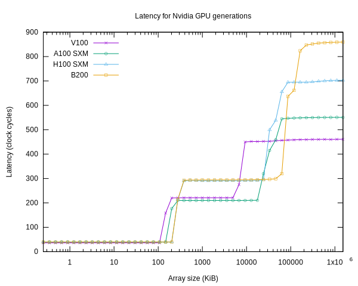

# Latency

Specifications for the latency of various GPU memories and caches can be hard to find.

This directory contains some microbenchmarks to compute those values.

Other sources of information:

* [Hopper Microbenchmarks](https://arxiv.org/abs/2501.12084v1)
* [Microbenchmarking the RTX 4090](https://chipsandcheese.com/2022/11/02/microbenchmarking-nvidias-rtx-4090/)
* [Ampere Microbenchmarks](https://arxiv.org/abs/2208.11174)
* [Volta Microbenchmarks](https://arxiv.org/abs/1804.06826)

Other latency benchmark codes:

* https://github.com/RRZE-HPC/gpu-benches/tree/master/gpu-latency

## Latency

All measurements are in clock cycles

| Hardware | L1  |  L2  | Main Memory |  L1 size (KiB) |  L2 size (MiB) | Main memory size (GiB) |
|----------|-----|------|-------------|----------------|----------------|------------------------|
| V100     | 36  | 221  | 460         |  128           |   6            | 32                     |
| RTX 2000 | 39  | 214  | 570         |  128           |   3            |  6                     |
| A100 SXM | 39  | 210  | 550         |  192           |   40           | 80                     |
| 4090     | 40  | 296  | 636         |  128           |   72           | 24                     |
| H100 SXM | 40  | 291  | 700         |  256           |   50           | 80                     |
| GH200    | 40  | 281  | 690         |  256           |   60           | 96                     |
| 5090     | 44  | 360  | 936         |  128           |   96           | 32                     |
| RTX PRO 6000 | 44  | 352  | 864     |  128           |   128          | 95.6                   |
| B200     | 40  | 295  | 860         |  256           |   126.5        | 179.1                  |
| B300     | 39  | 295  | 848         |  256           |   126.5        | 268.6                  |

Notes

* Clocks were not locked during the runs. Locking was tested on some hardware. On the RTX2000, it made a couple of cycles difference. On the B300, locking the graphics clocks to 2032 lowered the largest main memory latency from 848 to 810 cycles.
* The L1 latency is consistently a few cycles higher than the data from the RRZE-HPC benchmark data.  The difference between the benchmarks has not been isolated yet.

### Latency plot
The plot of latency for representative cards from several GPU generations shows the latency increasing in terms of clock cycles.  Consequently, kernels need to have more data in-flight to fully utilize the available bandwidth.

