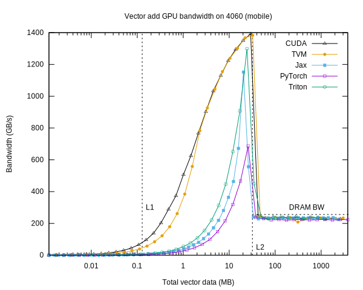

# Laptop

Some bandwidth measurements on my laptop.

Note the measurement code does not flush the caches between function calls.  The bandwidths of each cache level show up on the graphs.

## CPU

The CPU is an [Intel i9-13900HX](https://ark.intel.com/content/www/us/en/ark/products/232171/intel-core-i9-13900hx-processor-36m-cache-up-to-5-40-ghz.html). It uses the [Raptor Lake](https://en.wikipedia.org/wiki/Raptor_Lake) architecture.

This CPU has performance cores and efficiency cores.
The bandwidth measured here is for a single thread, restricted to use a performance core ("taskset -c 0").

Data and gnuplot plotting script are in the [`laptop-cpu`](laptop-cpu) directory.

## GPU

The GPU is an [NVIDIA 4060](https://www.techpowerup.com/gpu-specs/geforce-rtx-4060-mobile.c3946).
It uses the [Ada Lovelace](https://en.wikipedia.org/wiki/Ada_Lovelace_(microarchitecture)) architecture.

The maximum DRAM bandwidth is 256 GB/s.

The L2 bandwidth is particularly visible here.
The number of threads per block has a strong effect on the measured L2 bandwidth.  The CUDA result in the graph uses 128 threads.
The actual value doesn't seem to be published anywhere, but one of measured values for 256 threads (not shown) exceeds 1400 GB/s.

There is no performance boost for the L1 cache in these measurements, probably because:

 * The L1 cache is per-SM, and there is no control over SM scheduling for separate kernel invocations.
 * Kernel launch overhead

I don't know why the frameworks (other than TVM) have worse L2 performance.

Data and gnuplot plotting script are in the [`laptop-gpu`](laptop-gpu) directory.
